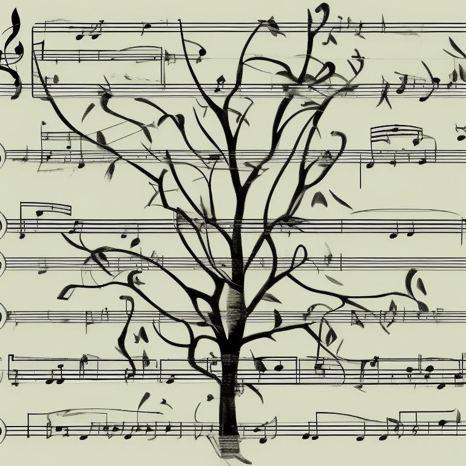
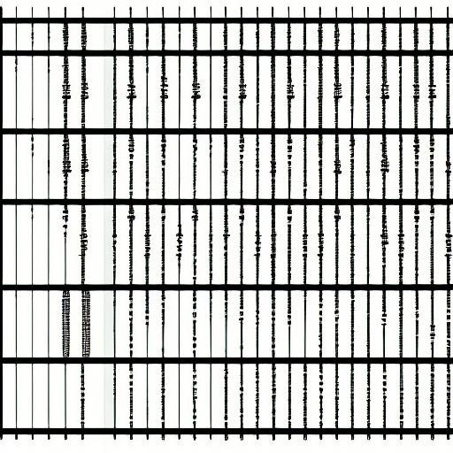
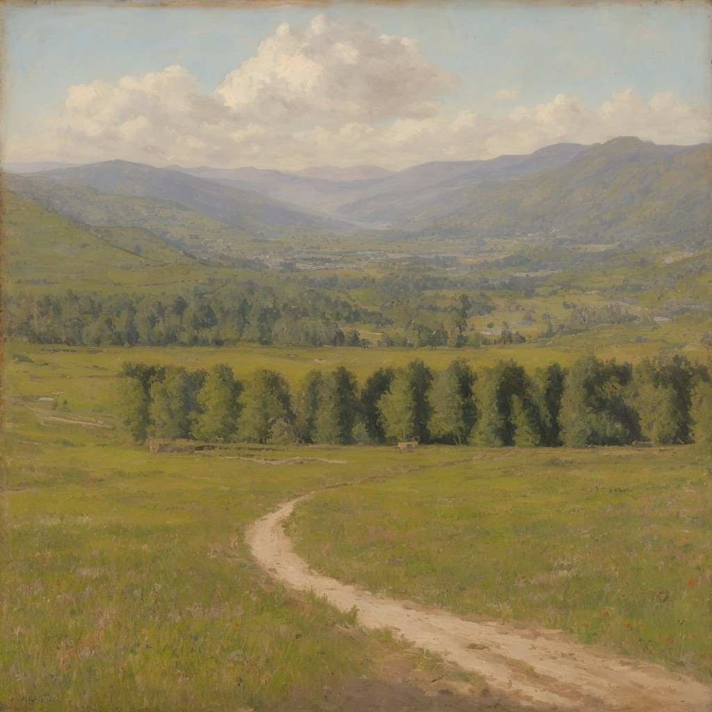

# Graphische Notation

Schwierigkeitsgrad: leicht

In dieser Übung generieren wir graphische Notationen mit KI-Modellen und erforschen, wie diese in der Musikpädagogik eingesetzt werden können. 
Es gibt verschiedene Bildgeneratoren, die auf KI basieren und Notationen generieren können. 

Generiere graphische Notationen mit KI-Modellen und erforsche, wie diese in der Musikpädagogik eingesetzt werden können.

## Stable Diffusion
Eines der bekanntesten Modelle für die Generierung von graphischer Notation ist das Stable Diffusion 2.1 Modell von [StabilityAI](https://stabilityai.com/). Dieses Modell kann auf der Huggingface Plattform getestet werden: https://huggingface.co/stabilityai/stable-diffusion-2-1

Huggingface 🤗 ist eine Platform auf der KI-Modelle hochgeladen und getestet werden können. Hier gibt es auch noch viele weitere KI-Modelle.

Hier kann unter `Inference API` in der rechten Spalte ein Text-Prompt eingegeben werden. Das Modell generiert dann ein Bild, welches (mit Rechtsklick) einfach heruntergeladen werden kann.

Hier zwei Beispiele, die mit dem Stable Diffusion 2.1 Modell generiert wurden:

    

        
        
graphical notation of a musical piece on the topic of trees

    

    

        
        
the score of a musical piece about the forest as graphical notation

    

Alternativ kann auch https://clipdrop.co/stable-diffusion-turbo genutzt werden, um das SDXL Turbo Modell zu testen. (Google-Account benötigt)

## Playground.com

Eine sehr benutzerfreundliche Website zur Generierung von Bildern ist auch [Playground.com](https://playground.com/) (Google-Account benötigt). Hier gibt es sehr viele Einstellungsmöglichkeiten, wie zum Beispiel die Bildgröße, welches KI-Modell genutzt werden soll und wie viele Bilder generiert werden sollen. Im Canvas-Modus können Bilder auch detaillierter bearbeitet werden. Für Fragen zu dieser Website wird hier der Einfachheit halber auf die [FAQ](https://playground.com/faq) verwiesen. 

## Weitere Bild-Generatoren
Es gibt noch viele weitere KI-Modelle, die Bilder generieren können:
- [Artbreeder](https://www.artbreeder.com/) (Google-Account benötigt) mit dem zum Beispiel auch Pattern-basierte Bilder generiert werden können:
    
- [Dall-E 3](https://huggingface.co/spaces/ehristoforu/dalle-3-xl) von OpenAI, welches auf Huggingface getestet werden kann oder auch über den [Image Generator von Microsoft](https://www.bing.com/create) verfügbar ist (Microsoft-Account benötigt). Auf Huggingface können über `Advanced` auch negative Prompts eingegeben werden, um das Modell zu steuern. Leider funktioniert das Huggingface-Modell nicht immer stabil.
- [Dall-E mini](https://huggingface.co/spaces/dalle-mini/dalle-mini)
- [Crayon](https://www.craiyon.com/) Hier kann über den Expert Mode auch ein Stil festgelegt werden.

Vergleiche unterschiedliche KI-Modelle und ihre Ergebnisse. Wie reagieren die Modelle auf unterschiedliche Prompts? 

## Einsatz in der Musikpädagogik
Graphische Notationen können in der Musikpädagogik vielfältig eingesetzt werden. So können sie einen barrierefreien Einstieg in die Musik ermöglichen, da sie wenig bis gar kein Vorwissen über Notenschrift voraussetzen. Auch können sie genutzt werden, um Schüler*innen eigene Musikstücke komponieren zu lassen. Entwickle ein Konzept, wie du graphische Notationen in deinem Unterricht einsetzen könntest.

## Umgekehrte Richtung
Text-to-Audio-Generatoren können auch genutzt werden um graphische Notationen oder andere Bilder zum Klingen zu bringen. Dafür kann ein weiteres KI-Modell genutzt werden, zunächst das Bild zu beschreiben um dann mit diesem Prompt ein Audio-File zu generieren.

In folgendem Hugginface Space kann ein Bild hochgeladen werden und ein Audio-File generiert werden:
https://huggingface.co/spaces/fffiloni/image-to-music-v2

Wie klingt zum Beispiel die Akademie für Tonkunst? Das folgende Bild der Akademie für Tonkunst übersetzte das Modell in folgenden Text:

> "A gentle acoustic guitar melody with soft piano chords and a subtle flute, accompanied by the soothing sound of rustling leaves and bird songs, creates a peaceful and contemplative ambiance that captures the serene beauty of the scene."

Das MusicGen-Modell wiederum interpretierte diesen Text zu folgendem Audio-File:

<audio controls>
  <source src="Akademie_fuer_Tonkunst_02.mp3" type="audio/mpeg">
  <a href="https://github.com/langMatthias/ai-intro/raw/main/exercises/easy/07%20-%20Graphische%20Notation/Akademie_fuer_Tonkunst_02.mp3">Audio File</a>
</audio> 

https://github.com/langMatthias/ai-intro/raw/main/exercises/easy/07%20-%20Graphische%20Notation/Akademie_fuer_Tonkunst_02.mp3

Wie klingt die graphische Notation, welche im ersten Teil generiert wurde? Wie klingt der Output von MusicGen, wenn der originale Prompt für die graphische Notation auch als Prompt für das Audio-File genutzt wird?